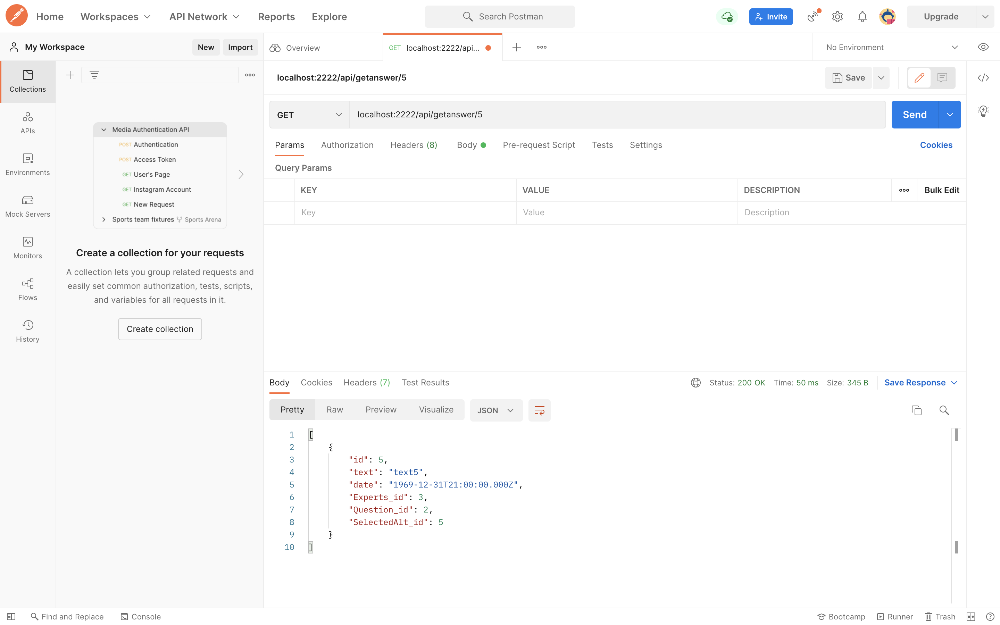
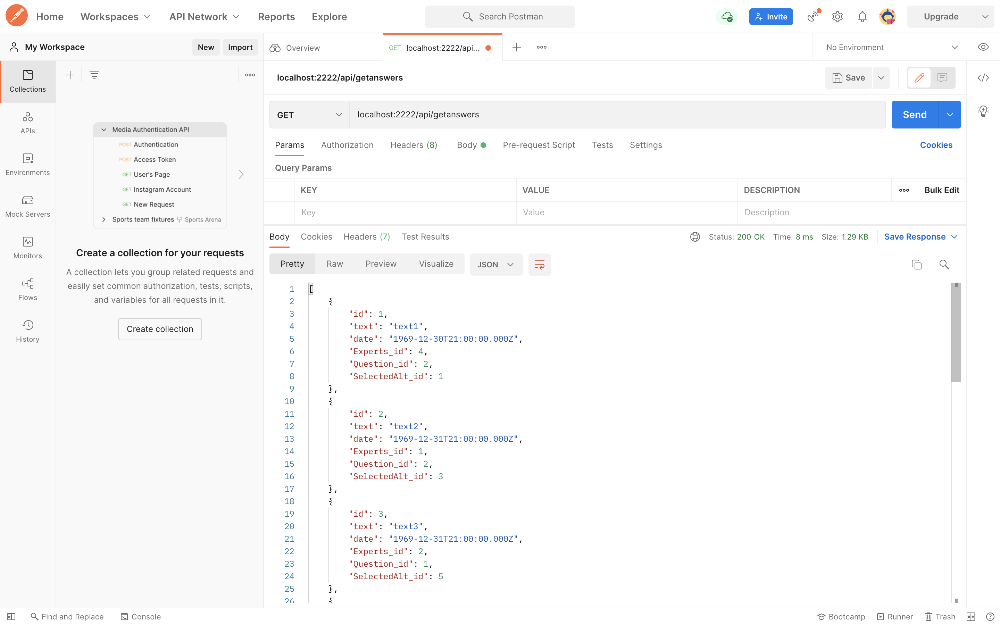
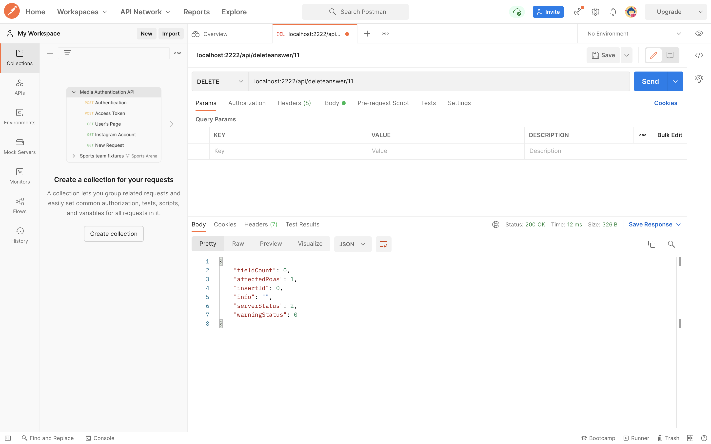
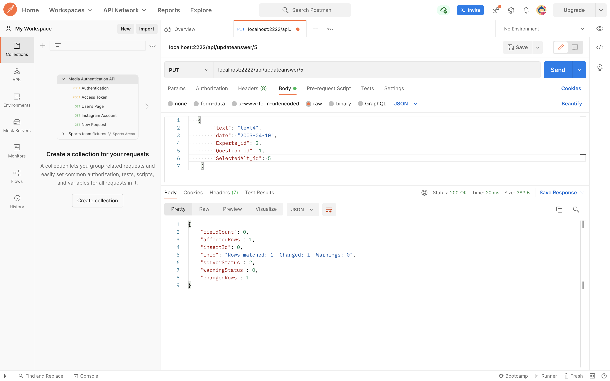

# Тестування працездатності системи

 *В цьому розділі необхідно вказати засоби тестування, навести вихідні коди тестів та результати тестування.*
 ## Отримати відповідь по id
 

 ## Отримати всі відповіді
 

 ## Додати нову відповідь
 

 ## Видалити відповідь по id
 

 ## Змінити відповідь по id
 